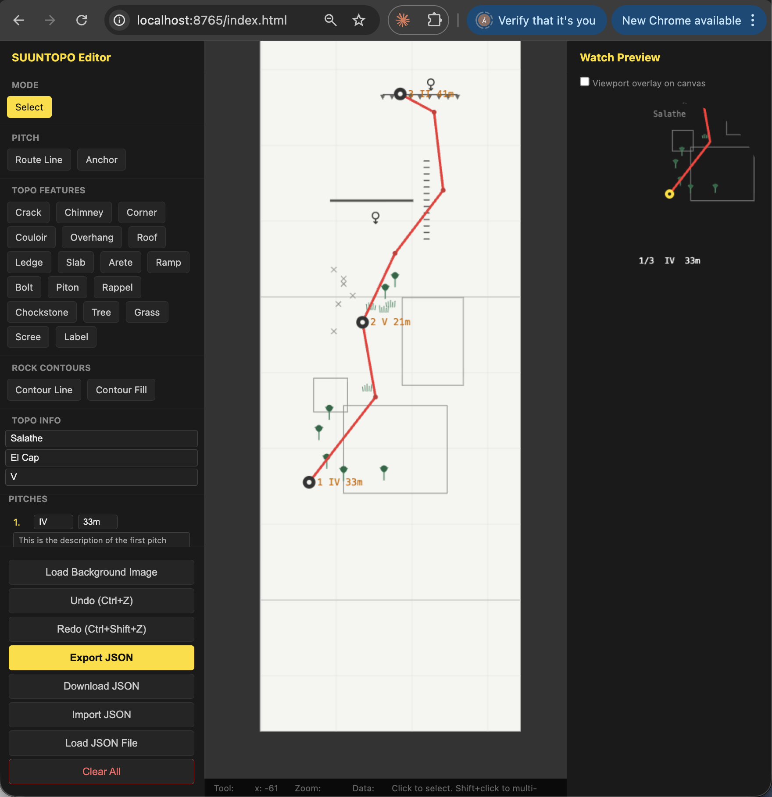
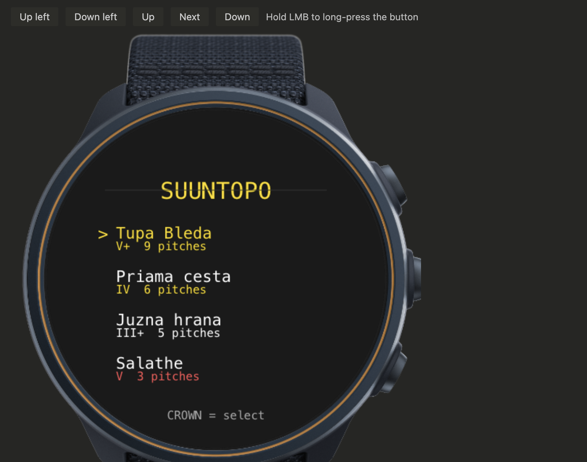
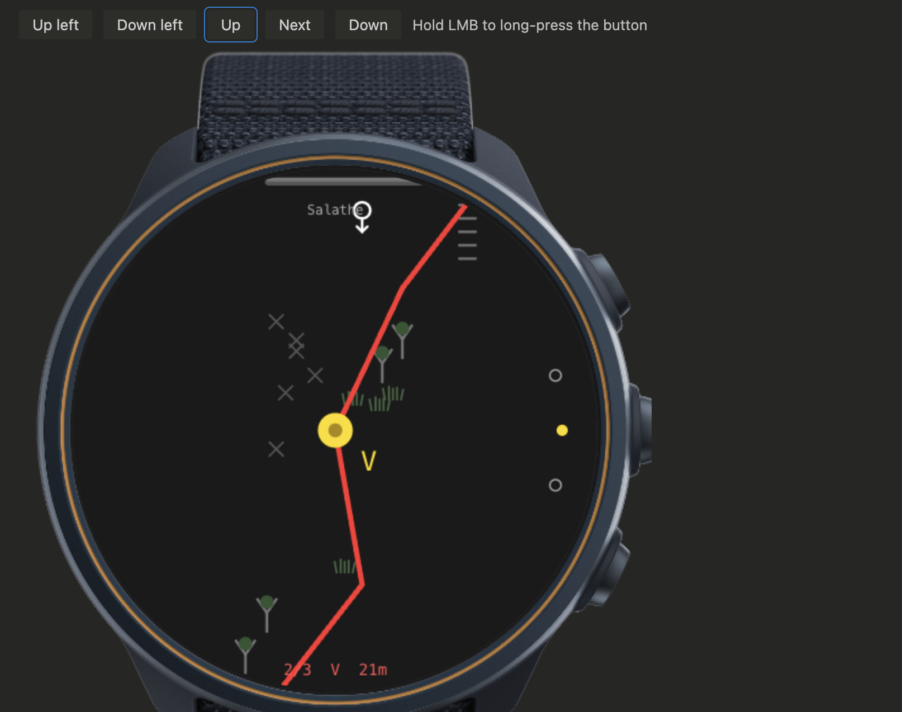
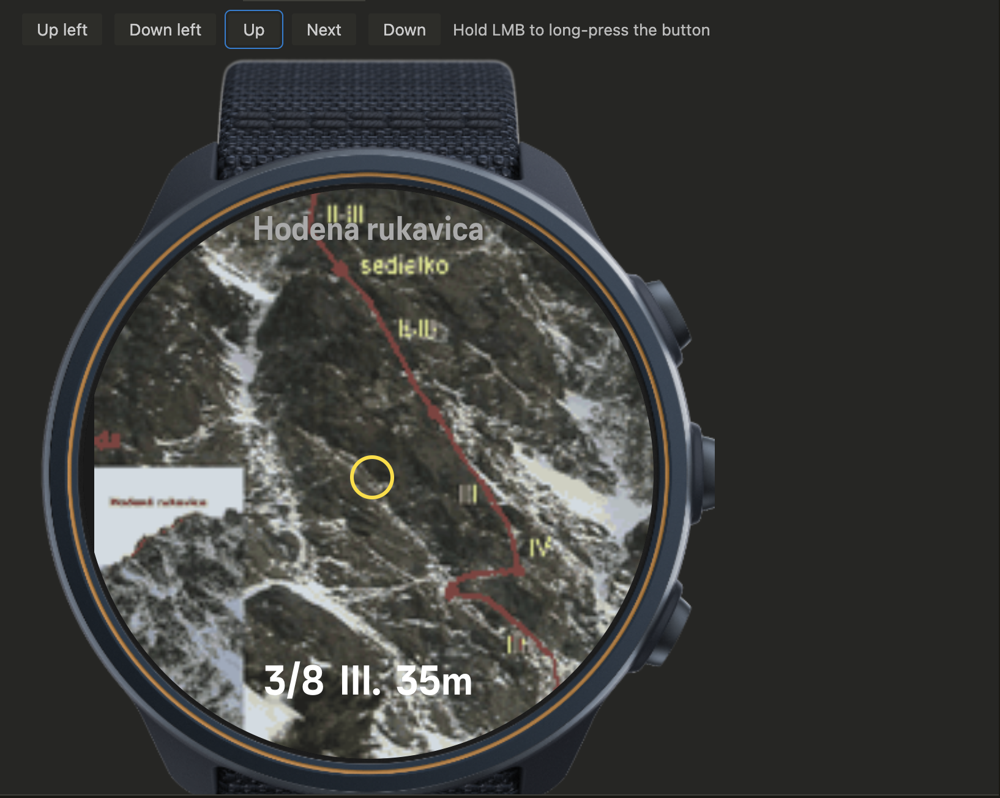

# SUUNTOPO

Interactive climbing topo viewer for Suunto watches (Race S, Race, Race 2, Vertical 2), built as a [SuuntoPlus Sports App](https://www.suunto.com/sports-apps/). Draw a route in the browser, sync the JSON to your watch, and navigate the topo pitch-by-pitch on the 466×466 px AMOLED screen using the physical buttons — without pulling out your phone.

**Status:** Phase 2-3 — canvas watch app with topo selector, visual web editor, sync via `data.json`.

**Author:** O. Vitya

## What it looks like

<table>
  <tr>
    <td width="50%" valign="top">
      <br/>
      <strong>1. Draw the topo in the browser.</strong> The visual editor (<code>src/topo_editor/index.html</code>) takes a background photo or a blank canvas and lets you place pitches, anchors, route lines, and standard symbols (crack, chimney, slab, ledge, bolt, rappel, …). The right-side panel previews how it will look on the watch. Export → JSON → paste into the watch app's settings.
    </td>
    <td width="50%" valign="top">
      <br/>
      <strong>2. Pick a route on the watch.</strong> Up to three topos sync over via SuuntoPlus settings. The selector shows route name, grade, and pitch count. Crown = select.
    </td>
  </tr>
  <tr>
    <td width="50%" valign="top">
      <br/>
      <strong>3. Navigate the topo.</strong> Anchors are yellow dots, the route line is red, and the active pitch grade plus length is shown at the bottom. Up/down buttons step between belay stations; the view auto-pans to keep the current anchor centered.
    </td>
    <td width="50%" valign="top">
      <br/>
      <strong>4. Photo-topo variant (experimental).</strong> Same navigation UX but with a real photo of the wall as the background. See the note below — this path needs the images baked into the build, so it isn't useful for everyday route sharing yet.
    </td>
  </tr>
</table>

## Two rendering paths

- **`suuntopo_canvas`** — *the working app.* Vector rendering via the watch's `<canvas>` API. Topo data is plain JSON sent over the SuuntoPlus phone settings, so adding a new route is just paste-and-save. This is what you should install.
- **`suuntopo_image`** — *experimental only.* Uses photo backgrounds for a more realistic look, but **syncing images via the phone does not work** (at least not in any way I've found): the PNGs have to be baked into the source and bundled by the SuuntoPlus build, then re-deployed over USB/Bluetooth for every new route. That makes it unfit for sharing topos between users — kept around for experiments and for the image-rendering path itself.

## Layout

```
SUUNTOPO/
├── docs/         Project planning: idea, implementation plans, test plans, hardware notes
│   └── images/   Screenshots used in this README
├── reference/    SuuntoPlus platform reference (API docs, examples) — external material
├── src/          Source code for every watch app + the web editor
│   ├── suuntopo_canvas/     Primary canvas-vector topo viewer (use this)
│   ├── suuntopo_image/      Image-based topo viewer (experimental, baked-in PNGs)
│   ├── suuntopo_hwtest/     Hardware test app v1
│   ├── suuntopo_hwtest2/    Hardware test app v2
│   ├── suuntopo_hwtest3/    Hardware test app v3 (selector + multi-subscribe + localStorage)
│   └── topo_editor/         Browser-based visual topo editor (single HTML file)
├── builds/       Versioned .fea / .zip build artifacts per app
├── CHANGELOG.md  Project-wide changelog, updated by the /build-suuntopo skill
└── CLAUDE.md     Repo instructions for Claude Code agents
```

## Building & deploying a watch app

Each `src/<app>/` directory is a SuuntoPlus app (manifest + template + main.js). Build and deploy via the **SuuntoPlus Editor** VS Code extension:

1. Open the folder in VS Code with the SuuntoPlus Editor extension installed.
2. Right-click the app folder in the SuuntoPlus side panel → **Build** (or use the command palette: `SuuntoPlus: Build SuuntoPlus App`).
3. The build produces six `.fea` files (one per display variant: `-l`, `-m`, `-n`, `-o`, `-q`, `-s`) plus a `.zip` package, alongside the source.
4. Right-click the app → **Deploy to Watch** (USB or Bluetooth).

Display ID **`-q`** corresponds to the 466×466 AMOLED (Race S, Vertical 2) — that is the primary target.

## Versioning a build

The `/build-suuntopo` skill (see `.claude/skills/build-suuntopo/SKILL.md`) automates the post-build workflow:

- Bumps the `version` in the app's `manifest.json`
- Moves the freshly built `.fea` / `.zip` artifacts into `builds/<app>/v<version>/`
- Generates a changelog entry by diffing source vs. the previous tagged version
- Optionally collects a tester feedback note
- Commits, tags `<app>-v<version>`, and pushes

Run `/build-suuntopo <app>` after building inside VS Code.

## Topo editor

`src/topo_editor/index.html` is a self-contained browser app for drawing climbing topos. Output is JSON that pastes directly into the watch app's `data.json` settings. See `src/topo_editor/EDITOR_SPEC.md` for the data format.

## Reference material

- `reference/suuntoplus_reference_docs.md` — full SuuntoPlus API reference (extracted from the Editor extension)
- `reference/suuntoplus_editor_commands.md` — every VS Code command exposed by the extension
- `reference/suunto_plus_examples/` — 13 official example apps
- Suunto developer forum: <https://forum.suunto.com/category/62/suunto-plus-development>

## Hardware constraints (short version)

- ES5 JavaScript only (no arrow functions, no `Date`, no `sessionStorage`)
- Max 2 images per app, max 64 colors per image (RGB, no alpha)
- Max 10 input resources, max 5 logged variables, max 15 apps installed at once
- Display: 466×466 circular, refresh capped around 10 Hz on hardware
- CSS on watch is much narrower than in the simulator — see `docs/suunto_development.md`

The simulator is more featureful than the watch. Always test on hardware before declaring a build done.
