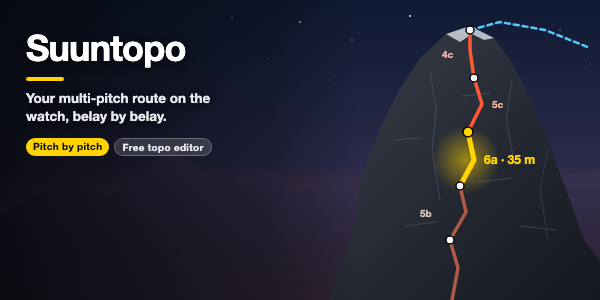
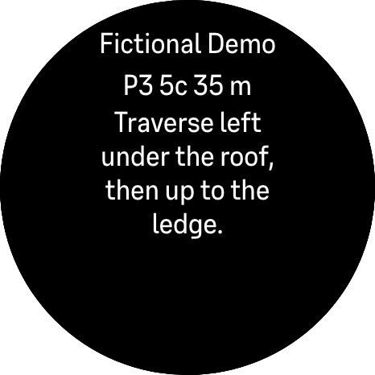
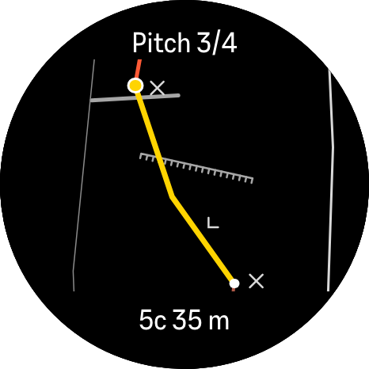
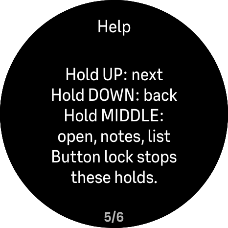
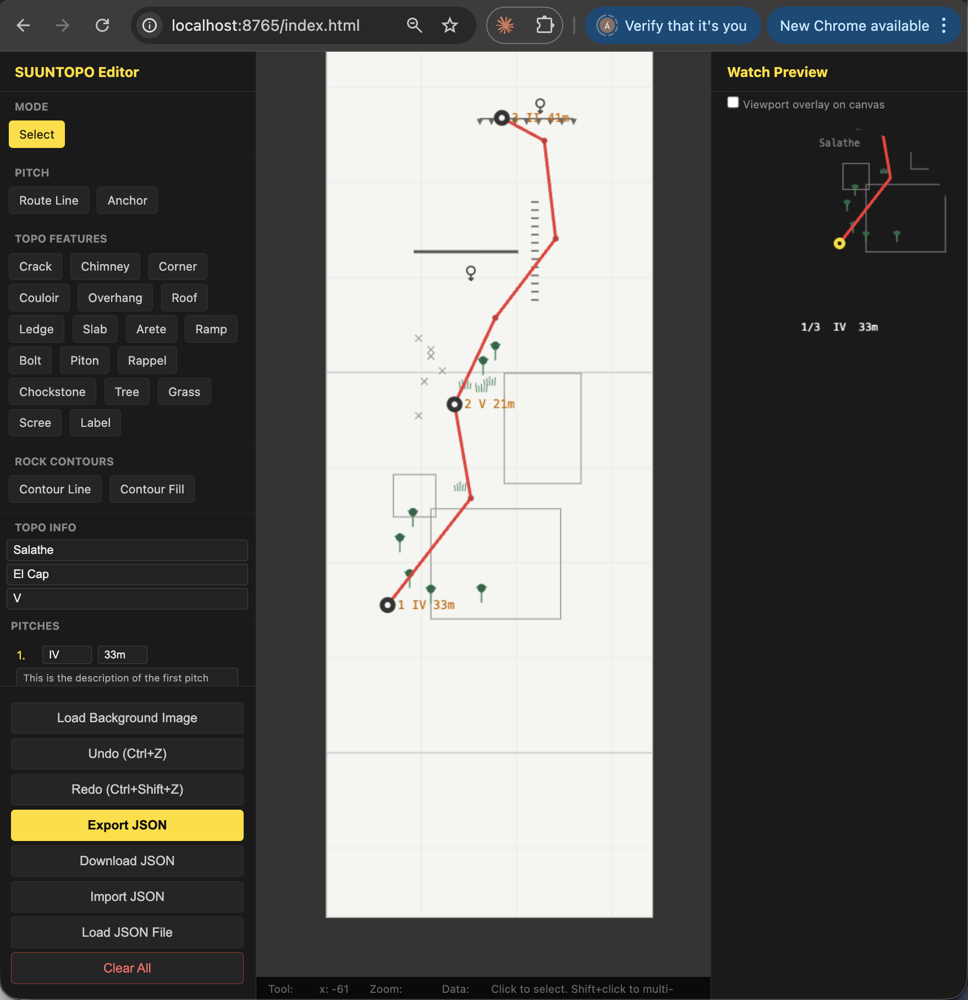
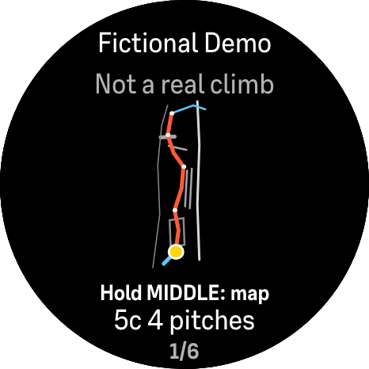
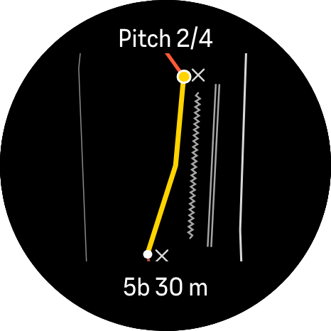

# SUUNTOPO



Interactive climbing topo viewer for Suunto watches (Race S, Race, Race 2, Vertical 2), built as a [SuuntoPlus Sports App](https://www.suunto.com/sports-apps/). Draw a route in the browser, paste one line into the app's settings, and navigate the topo pitch-by-pitch on the 466×466 px AMOLED screen using the physical buttons — without pulling out your phone.

**Status (2026-10-05):** Suuntopo v1.0 (`src/suuntopo_canvas`) loads, draws and navigates on a Race S when it is the only SuuntoPlus app in its sport mode (see `docs/suuntopo_canvas/HW_RESULTS.md`; some release gates are still open). The topo editor is live at <https://topo-editor.vercel.app> (source in `src/topo_editor/`). The store submission is in progress: the API Zone console currently rejects it with a server error under investigation. Suuntopo is an independent app, not affiliated with or endorsed by Suunto.

**Author:** O. Vitya

## Store images

| Map at pitch 2 | Topo list | Pitch notes | Traverse under a roof | Help |
|---|---|---|---|---|
|  |  |  |  |  |

Store banner, app image and package ready to upload: [`store/suuntopo_canvas/upload/`](store/suuntopo_canvas/upload/). Store text and console form map: [`listing.md`](store/suuntopo_canvas/listing.md), paste-ready description: [`description.md`](store/suuntopo_canvas/description.md).

## What it looks like

<table>
  <tr>
    <td width="50%" valign="top">
      <br/>
      <strong>1. Draw the topo in the browser.</strong> The visual editor (<a href="https://topo-editor.vercel.app">topo-editor.vercel.app</a>, source <code>src/topo_editor/index.html</code>) takes a background photo or a blank canvas and lets you place pitches, anchors, route lines, and standard symbols (crack, chimney, slab, ledge, bolt, rappel, …). The right-side panel runs the watch app's own renderer to show how it will look on the watch. **Copy for Suunto app** copies the topo as one line (at most 1,500 bytes); send it to your phone and paste it into the app's "Topo line from editor" setting in the Suunto app.
    </td>
    <td width="50%" valign="top">
      <br/>
      <strong>2. Pick a topo on the watch.</strong> The topo list holds your synced topo and four built-in topos: a fictional demo, a fictional 30-pitch wall, and two schematic sketches of real routes. Each card shows the name, grade and pitch count, and the open topo is drawn whole. Hold MIDDLE to open one.
    </td>
  </tr>
  <tr>
    <td width="50%" valign="top">
      <br/>
      <strong>3. Navigate belay by belay.</strong> The current pitch is yellow and auto-fitted, with its grade and length below. Hold UP or DOWN to step between belays, and hold MIDDLE for the pitch notes. Short presses stay native, so pause, lap and display change always work. Optionally, a lap moves to the next pitch.
    </td>
  </tr>
</table>

**Developers:** start with [DEVELOPMENT.md](DEVELOPMENT.md) (tooling, daily loop, architecture, watch limits).

## The app

`src/suuntopo_canvas` is the watch app (store name "Suuntopo", app ID `suunto01`). It draws the topo with the watch's `<canvas>` API. A topo is one compact `STP1` line sent through the SuuntoPlus phone settings, so adding a route is paste-and-sync. See `src/suuntopo_canvas/README.md`. Earlier experiments (hardware test apps and a photo-background variant whose images cannot be synced from the phone) are in `archive/`.

## Layout

```
SUUNTOPO/
├── src/
│   ├── suuntopo_canvas/   The watch app (Suuntopo)
│   └── topo_editor/       Browser topo editor (live at topo-editor.vercel.app)
├── test/                  Node test suites (node test/suuntopo_canvas/run.js)
├── store/                 Store listing, form map, description, banner, screenshots
├── builds/                Versioned .fea builds and the store source package
├── docs/                  Spec and hardware results (docs/suuntopo_canvas), platform research, screenshots
├── tools/                 sp-build, sp-mem, VS Code MCP bridge, watch-log, safe-area; SHARED_RESOURCES.md
├── reference/             SuuntoPlus platform reference (API docs, examples)
├── archive/               Retired experiments, old plans and the first handoff
├── CHANGELOG.md
└── CLAUDE.md              Instructions for Claude Code
```

## Building & deploying a watch app

Each `src/<app>/` directory is a SuuntoPlus app (manifest + template + main.js). Build and deploy via the **SuuntoPlus Editor** VS Code extension:

1. Open the folder in VS Code with the SuuntoPlus Editor extension installed.
2. Right-click the app folder in the SuuntoPlus side panel → **Build** (or use the command palette: `SuuntoPlus: Build SuuntoPlus App`).
3. The build produces six `.fea` files (one per display variant: `-l`, `-m`, `-n`, `-o`, `-q`, `-s`) plus a `.zip` package, alongside the source.
4. Right-click the app → **Deploy to Watch** (USB or Bluetooth).

Display ID **`-q`** corresponds to the 466×466 AMOLED (Race S, Vertical 2) — that is the primary target.

## Versioning a build

The `/build-suuntopo` skill (see `.claude/skills/build-suuntopo/SKILL.md`) automates the post-build workflow:

- Bumps the `version` in the app's `manifest.json`
- Moves the freshly built `.fea` / `.zip` artifacts into `builds/<app>/v<version>/`
- Generates a changelog entry by diffing source vs. the previous tagged version
- Optionally collects a tester feedback note
- Commits, tags `<app>-v<version>`, and pushes

Run `/build-suuntopo <app>` after building inside VS Code.

## Topo editor

The browser editor for Suuntopo topos lives in this repo, in `src/topo_editor/`, and runs live at **<https://topo-editor.vercel.app>**. It is a static page: no install, no account, nothing uploaded.

1. Open the editor on a computer (or open `src/topo_editor/index.html` locally).
2. Draw the route, mark the belays, add features, and fill in each pitch's grade, length and notes. A background photo can be traced with a 4-corner perspective transform.
3. Press **Copy for Suunto app**. This copies the topo as one `STP1` line (at most 1,500 bytes; the editor counts them and checks the line with the watch app's own parser).
4. Send the line to your phone, paste it into Suuntopo's **Topo line from editor** setting in the Suunto app, and sync the watch.

Also: **Download built-in file (ext.js)** writes the topo as a built-in for the app package (up to 3,500 bytes), and **Save project / Load project file** keeps the editable JSON. **On the watch: how to and FAQ** is the user guide for the watch app.

The watch preview on the right runs the watch app's own renderer and parser from `watch.js`, generated by `node src/topo_editor/sync-watch.js` (`--check` exits 1 when it is stale). Tools, data formats and shortcuts: `src/topo_editor/EDITOR_SPEC.md`.

**Deploying the editor:** `cd src/topo_editor && npx vercel@latest deploy --prod --yes` (the folder is linked to the Vercel project `topo-editor`; `.vercelignore` keeps the spec, the generator and the reference images out). The repo [aabbeell/topo-editor](https://github.com/aabbeell/topo-editor) was the editor's first public home and now points here.

## Tests

```
node test/suuntopo_canvas/run.js        # Suuntopo: codec, renderer budget, navigation, stream, build, editor
```

The suite exits non-zero on any failure. `QUICK=1` shortens the random-session test.

## Reference material

- `reference/suuntoplus_reference_docs.md` — full SuuntoPlus API reference (extracted from the Editor extension)
- `reference/suuntoplus_editor_commands.md` — every VS Code command exposed by the extension
- `reference/suunto_plus_examples/` — 13 official example apps
- Suunto developer forum: <https://forum.suunto.com/category/62/suunto-plus-development>

## Hardware constraints (short version)

- ES5 JavaScript only (no arrow functions, no `Date`, no `sessionStorage`)
- Max 2 images per app, max 64 colors per image (RGB, no alpha)
- Max 10 input resources, max 5 logged variables, max 15 apps installed at once
- Display: 466×466 circular, refresh capped around 10 Hz on hardware
- CSS on watch is much narrower than in the simulator — see `docs/suunto_development.md`

The simulator is more featureful than the watch. Always test on hardware before declaring a build done.

## Related projects

- [suuntoplus-agentic-dev-env](https://github.com/aabbeell/suuntoplus-agentic-dev-env): command-line and agent tooling for building, deploying and debugging SuuntoPlus apps
- [AirTemp for Suunto](https://github.com/aabbeell/suunto-airtemp): air temperature and humidity from a Bluetooth sensor
- [VarioLink for Suunto](https://github.com/aabbeell/suunto-variolink): paragliding vario display for Bluetooth varios
