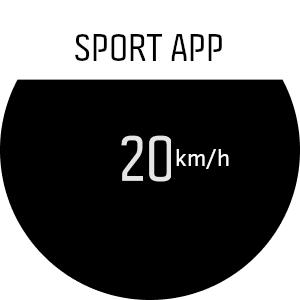
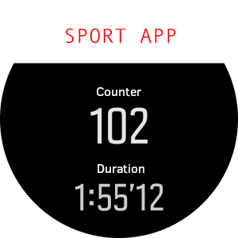
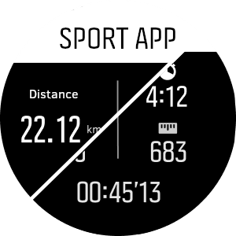
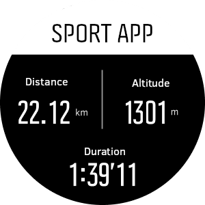
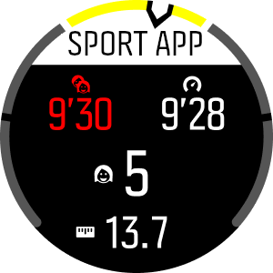
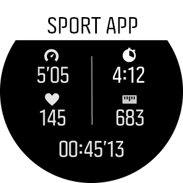

# SuuntoPlus examples #

SuuntoPlus example apps

## Buttons ##

Demonstrates use of watch buttons.

## DynamicIcons ##

Changes icons and icon color according to values calculated in `main.js`.

## Graph ##

Data visualization with HTML `graph` element.

## MultiSensor ##

Demonstrates connecting to two BLE sensors. All service and characteristic UUID
values are 01020304-0506-0708-090A-0B0C0D0E0F00, replace them with real UUID
values for the devices.

## MultiView ##

Changes between two HTML templates with lower button.

## Popup ##

Demonstrates use of popup views with one or two buttons for user input.

This example only works in watches with UI version 2.

## TemplateLayout1 ##

One value field with unit.

## TemplateLayout2 ##

Two value fields and logo image on top.

Image: large e.g. 160x43 pixels, medium/small e.g. 110x29, PNG, current tooling
requires the file extension to be .a64.png

## TemplateLayout2Views ##

Two different views (one at a time).

This template demonstrates how to change the HTML view (note that only one at a
time is possible) during the exercise. Press lap button to change view.

## TemplateLayout3 ##

Three value fields (two alternating views in one HTML file).

Top-left and top-right fields are alternated every five seconds (i.e. five
different values are shown in total).

## TemplateLayout4 ##

Four value fields with icons + zone gauge

Content of each field is indicated with an icon. Top left field switches
between two values every 5 seconds.

## TemplateLayout5 ##

Five value fields with icons

